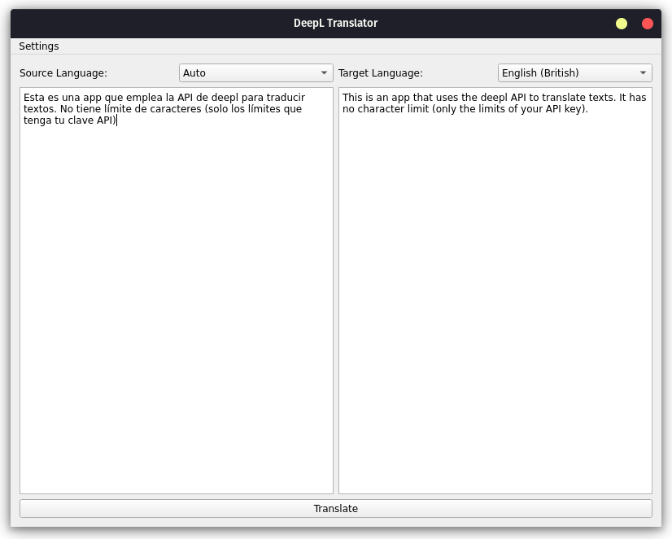

# DeepL Translator GUI for Linux

This is a simple Python application that provides a GUI for using the DeepL translation service on Linux systems (also available for Windows and Mac). It uses PyQt5 for the interface and DeepL's API for translation, and it is designed to run within a Python virtual environment.



## Features

- **Translate Text:** Input text and translate it to a target language.
- **Source Language Detection:** Automatically detect the source language or select manually.
- **Hotkey Integration:** Double-press `Ctrl+C` to copy text to the application for translation.
- **API Key Storage:** Store and reuse your DeepL API key across sessions.
- **Multi-Threading:** Translations run in the background, ensuring the UI remains responsive.

## Installation

1. Clone the repository:
   ```bash
   git clone https://github.com/frrobledo/deepl_py.git
   cd DeepL-Translator-GUI
   ```

2. Create a virtual environment:
   ```bash
   python3 -m venv .venv
   ```

3. Activate the virtual environment:
   ```bash
   source .venv/bin/activate
   ```

4. Install the dependencies:
   ```bash
   pip install -r requirements.txt
   ```

5. Make the `main.py` script executable:
   ```bash
   chmod +x main.py
   ```

6. Make the `run_deepl.sh` script executable:
   ```bash
   chmod +x run_deepl.sh
   ```

## Running the Application

To run the application, use the following command:

```bash
./run_deepl.sh
```

This script will automatically activate the virtual environment and run the app. You must always use this script to ensure that the app runs inside the virtual environment.

## Setting the API Key

1. Open the application by running `./run_deepl.sh`.
2. In the top menu, select "Settings" > "Set API Key".
3. Enter your DeepL API key.

If you don't have a DeepL API key, you can sign up for one [here](https://www.deepl.com/pro-api).

## Requirements

- Python 3.x
- DeepL API key

### Dependencies

All dependencies are listed in the `requirements.txt` file, including:

- `deepl`
- `PyQt5`
- `requests`
- `pynput`

## How to Use

1. Launch the app using `./run_deepl.sh`.
2. Select your source and target languages from the dropdown menus.
3. Type or paste text into the input area.
4. Press the "Translate" button or use `Ctrl+Enter` to translate the text.
5. The translated text will appear in the output area.

## Hotkeys

- **Double Ctrl+C**: Copies the selected text from the clipboard into the translation input box.

## Contributing

Feel free to fork this repository, open issues, and submit pull requests.

## License

This project is licensed under the MIT License.
